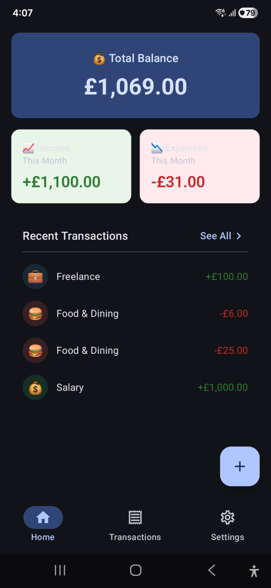
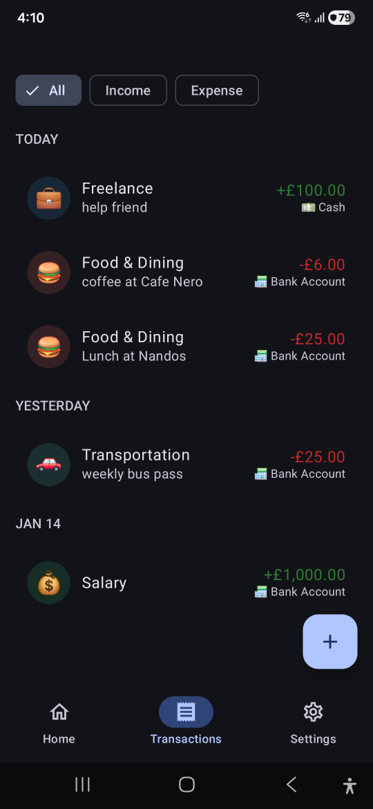
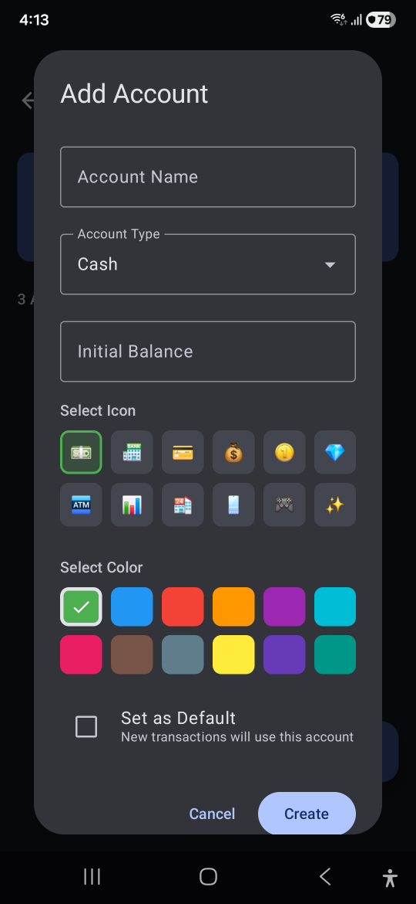
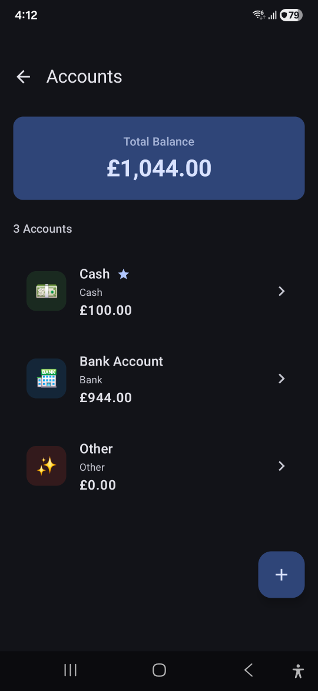

# ExpenseFlow - Personal Expense Tracker

<p align="center">
  
</p>

A simple Personal Expense Tracker built with **Jetpack Compose**, **Android Room** and **Clean Architecture (MVVM/MVI)**.

---
<p align="center">
  <a href="https://android-arsenal.com/api?level=29"></a>
  <a href="https://kotlinlang.org"></a>
  <a href="https://developer.android.com/jetpack/compose"></a>
</p>

---

## ✨ Features

- **📊 Dashboard** — Real-time overview of income, expenses, and balance with latest transactions
- **💳 Transaction Management** — Full CRUD operations for income and expense transactions
- **🏦 Multiple Accounts** — Track Cash, Bank, and custom account types
- **🏷️ Custom Categories** — Organize transactions with icons and colors

---

## 📸 Screenshots

<p align="center">
  
  
  
  
</p>

---

## 🏗️ Architecture

ExpenseFlow follows **Clean Architecture** with **MVVM/MVI** pattern, ensuring separation of concerns.

```
┌────────────────────────────────────────────────────────────────────────────┐
│                              PRESENTATION LAYER                            │
│  ┌─────────────────────────────────────────────────────────────────────┐   │
│  │  Screens (Compose)    │    ViewModels    │    UI State/Events       │   │
│  └─────────────────────────────────────────────────────────────────────┘   │
├────────────────────────────────────────────────────────────────────────────┤
│                                DOMAIN LAYER                                │
│  ┌─────────────────────────────────────────────────────────────────────┐   │
│  │  Use Cases    │    Domain Models    │    Repository Interfaces      │   │
│  └─────────────────────────────────────────────────────────────────────┘   │
├────────────────────────────────────────────────────────────────────────────┤
│                                 DATA LAYER                                 │
│  ┌─────────────────────────────────────────────────────────────────────┐   │
│  │  Repository Impl    │    Room DAOs    │    Entities & Mappers       │   │
│  └─────────────────────────────────────────────────────────────────────┘   │
└────────────────────────────────────────────────────────────────────────────┘
```
## 🛠️ Tech Stack

| Category | Technology |
|----------|------------|
| **Language** | Kotlin 2.2.21 |
| **UI Framework** | Jetpack Compose |
| **Architecture** | Clean Architecture + MVVM/MVI |
| **Dependency Injection** | Dagger Hilt |
| **Database** | Room (SQLite) |
| **Async** | Kotlin Coroutines + Flow |
| **Navigation** | Compose Navigation |
| **Build System** | Gradle KTS + Version Catalog |

---

## 📁 Project Structure

```
app/
├── src/main/java/com/uansari/expenseflow/
│   ├── core/                          # Shared utilities
│   │   ├── di/                        # Hilt modules
│   │   ├── navigation/                # Navigation setup
│   │   └── ui/                        # Theme, common components
│   │
│   ├── data/                          # Data layer
│   │   ├── local/                     # Room database
│   │   │   ├── dao/                   # Data Access Objects
│   │   │   ├── entity/                # Database entities
│   │   │   └── ExpenseDatabase.kt     # Room database class
│   │   ├── mapper/                    # Entity ↔ Domain mappers
│   │   └── repository/                # Repository implementations
│   │
│   ├── domain/                        # Domain layer
│   │   ├── model/                     # Domain models
│   │   ├── repository/                # Repository interfaces
│   │   └── usecase/                   # Business logic use cases
│   │       ├── account/
│   │       ├── category/
│   │       └── transaction/
│   │
│   └── feature/                       # Feature modules
│       ├── accounts/                  # Accounts management
│       ├── categories/                # Categories management
│       ├── dashboard/                 # Dashboard screen
│       ├── settings/                  # Settings screen
│       └── transactions/              # Transaction CRUD
│
├── build.gradle.kts
└── gradle/
    └── libs.versions.toml             # Version catalog
```

## 🗃️ Database Schema

```
┌─────────────────────┐     ┌─────────────────────┐     ┌─────────────────────┐
│     ACCOUNTS        │     │    TRANSACTIONS     │     │     CATEGORIES      │
├─────────────────────┤     ├─────────────────────┤     ├─────────────────────┤
│ id (PK)             │────<│ accountId (FK)      │>────│ id (PK)             │
│ name                │     │ id (PK)             │     │ name                │
│ type                │     │ amount              │     │ icon                │
│ balance             │     │ type (INCOME/EXP)   │     │ color               │
│ icon                │     │ categoryId (FK)     │     │ type (INCOME/EXP)   │
│ color               │     │ date                │     │ isDefault           │
│ isDefault           │     │ note                │     │ createdAt           │
│ createdAt           │     │ createdAt           │     └─────────────────────┘
└─────────────────────┘     └─────────────────────┘
```

## 🎯 Key Implementation Highlights

### Reactive State Management

```kotlin
// ViewModel with StateFlow
class TransactionsViewModel @Inject constructor(
    private val getTransactionsUseCase: GetTransactionsUseCase
) : ViewModel() {

    private val _uiState = MutableStateFlow(TransactionsUiState())
    val uiState: StateFlow<TransactionsUiState> = _uiState.asStateFlow()

    init {
        loadTransactions()
    }
}
```

### Clean Use Case Pattern

```kotlin
class AddTransactionUseCase @Inject constructor(
    private val transactionRepository: TransactionRepository,
    private val accountRepository: AccountRepository
) {
    suspend operator fun invoke(transaction: TransactionDom): Result<Unit> {
        // Validate and execute business logic
        return transactionRepository.insert(transaction)
    }
}
```
---

## 🗺️ Roadmap

- [x] Core transaction management
- [x] Account management
- [x] Category management
- [x] Dashboard with summaries
- [ ] Data export (CSV/PDF)
- [ ] Budget tracking
- [ ] Reports & Charts (Pie/Bar)
- [ ] Cloud sync (Firebase)

---


## 👤 Author

**Usman Ansari**

- GitHub: [@UsmanAnsari](https://github.com/UsmanAnsari)
- LinkedIn: [Usman Ansari](https://www.linkedin.com/in/usman1ansari/)

---

<p align="center">
  Made with ❤️ Kotlin and Jetpack Compose
</p>
